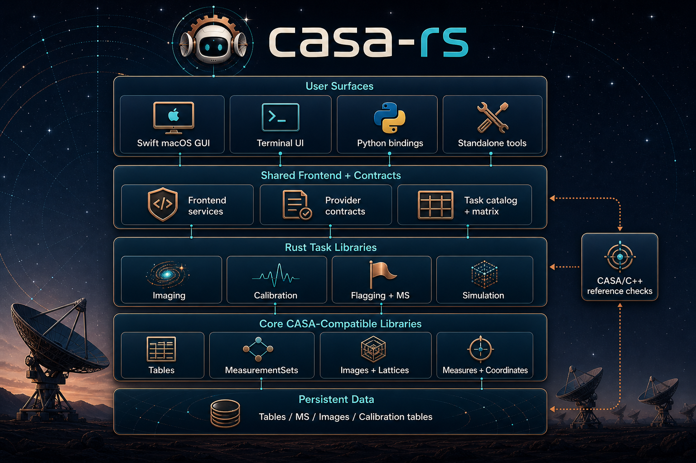

# casa-rs

Truth class: current descriptive
Last reality check: 2026-05-09
Verification: just docs-check


`casa-rs` is an experiment/hobby project by Brian Glendenning, NRAO retiree. I
am happy for people to experiment with it or use it under the LGPL license, but
there is no institutional support.

This is a from-scratch Rust experimental re-implementation of pieces of CASA
and casacore, with Swift for the native macOS UI. It uses CASA and casacore for
performance comparisons and calculation checks, but does not directly reuse
their source code. The source code is basically entirely written by AI, first
Claude and now Codex, prompted by me using various strategies. The current
workflow is my semi-homebrew Wave Driven Agentic Development process; see
[`AGENTS.md`](AGENTS.md). Experimenting with development methodology is part of
the hobby.

The project currently has four broad aspects:

1. Persistent data-structure interoperability with CASA: tables, MeasurementSets,
   images, calibration tables, and related on-disk artifacts.
2. Most casacore-style infrastructure needed by those workflows, excluding
   broad homebrew CASA fitting/scimath surfaces where Rust libraries or narrower
   native implementations make more sense.
3. CASA-like imaging, calibration, flagging, simulation, import, and analysis
   capability in Rust libraries and command-line task binaries.
4. User surfaces: a native macOS GUI in Swift, a terminal UI with Kitty graphics
   support, Python bindings, and standalone executables.

Current status: all of the above exist and are pretty functional, but they are
not yet easy to use. I will probably tag this as v1.0 when the CASA tutorials
are straightforward to work through.

This README is for users of the repo's libraries and applications.
Contributor/developer policy is in `AGENTS.md`.

## Project Process

- `AGENTS.md` is the canonical agent operating contract.
- `ARCHITECTURE.md` is the current workspace map and boundary summary.
- `TESTING.md` defines the test strategy and done gate.
- `docs/adr/` holds accepted architecture decisions.
- GitHub Issues / Project are the canonical planning and wave-status surface.
- `docs/Planning/` is retained as historical or program-reference material only.

## Documentation

- documentation site: [bglenden.github.io/casa-rs](https://bglenden.github.io/casa-rs/)
- Rust API docs: [bglenden.github.io/casa-rs/rustdoc](https://bglenden.github.io/casa-rs/rustdoc/)
- docs index: [`docs/README.md`](docs/README.md)
- `casars` framework guide:
  [`docs/casars-tui-framework.md`](docs/casars-tui-framework.md)
- `casars calibrate` user guide:
  [`docs/casars-calibrate-user-guide.md`](docs/casars-calibrate-user-guide.md)

The Rust API docs are generated for the whole workspace with
`cargo doc --workspace --no-deps`. They are API reference docs, not a polished
manual or tutorial set, so many crate pages are still mostly rustdoc item
tables.

## Branding Assets

Generated project branding assets live under [`branding/`](branding/). The
current set includes a wide README/docs header, a macOS `.icns` app icon, and
source PNGs for future revisions.

## Source Layout



`casa-*` crates are reusable libraries. `casars-*` crates are application,
runtime, protocol, and frontend-service crates. The repo implements
CASA/casacore-compatible behavior in native Rust; it is not a Rust wrapper
around casacore C++.

| Area | Main code | Current capability |
|---|---|---|
| Tables | `casa-tables`, `tablebrowser` | Persistent tables, schema and mutation APIs, storage managers, broad practical TaQL support, and interactive table browsing. |
| MeasurementSets | `casa-ms`, `msexplore` | Typed MS access, summaries, selections, plotting/export payloads, derived columns, flag versions, and MS-focused inspection. |
| Images/lattices | `casa-images`, `casa-lattices`, `imexplore` | Persistent images, masks, regions, lazy expressions, statistics, image-browser sessions, and image analysis tasks. |
| Coordinates/measures | `casa-coordinates`, `casa-measures-data`, `casa-measures-tools`, `casa-types` | Units, quanta, measures, CASA-table-backed runtime data, frame-aware conversions, and coordinate systems. |
| Imaging | `casars-imager`, `casa-imaging` | Dirty imaging, tclean-style workflows, cube/mosaic/multiscale pieces, automasking pieces, export/import FITS paths, and tutorial parity scripts. |
| Calibration | `casa-calibration`, `calibrate` | `applycal`, `gaincal`, `bandpass`, `fluxscale`, callib handling, stats, diagnostics, and guided CLI/TUI workflows. |
| Flagging | `casa-ms`, `flagdata`, `flagmanager`, GUI/TUI task panels | Flag summary and mutation workflows, manual/clip/quack/tfcrop/rflag-family coverage where implemented, flag-version save/list/restore/delete/rename workflows, and frontend confirmation paths. |
| Simulation/import | `casa-ms`, `casa-vla`, `simobserve`, `importvla` | Simulation and VLA import paths with CASA comparison harnesses and tutorial-backed parity evidence. |
| Python | `casars-python` | Python package wrappers that discover suite-installed task binaries and expose task protocols. |
| TUI | `casars`, `casars-*browser-protocol` | Ratatui shells for task operation, table/MS/image browsing, and Kitty-capable graphics workflows. |
| macOS GUI | `apps/casars-mac`, `casars-frontend-services` | Native SwiftUI workbench backed by Rust frontend services and shared task contracts. |
| Provider contracts | `casa-provider-contracts`, `resources/task-catalog.json`, `resources/task-execution-matrix.json` | Versioned schema/task contracts shared by standalone binaries, TUI, GUI, and Python. |

Approximate source lines of code, measured with `cloc` over `crates/`, `apps/`,
and `scripts/`, excluding generated build directories:

| Language | Files | Non-test SLOC | Test/example/bench SLOC | Total SLOC |
|---|---:|---:|---:|---:|
| Rust | 478 | 283,579 | 73,627 | 357,206 |
| Swift | 14 | 20,179 | 2,660 | 22,839 |
| Bourne Shell | 55 | 10,038 | 0 | 10,038 |
| Python | 26 | 3,901 | 1,055 | 4,956 |
| C/C++ Header | 2 | 701 | 0 | 701 |
| **Total** | **575** | **318,398** | **77,342** | **395,740** |

Test/example/bench SLOC is classified by file path, including `tests/`,
`Tests/`, `benches/`, `examples/`, and `src/tests.rs`.

## Casacore C++ Module Coverage

Status legend:
- `Available now`: substantial, usable implementation exists in this repo today.
- `Partial / Available now`: a real subset exists and is usable today, but broad
  module-wide parity is not claimed.
- `Deferred/Not planned`: intentionally out of current scope.

| casacore-c++ module | casa-rs status | Notes |
|---|---|---|
| `casa` | Partial / Available now | `casa-types` covers the core scalar/array/record value model plus quanta/measures foundations. Broader `casa` utility parity is not a target. |
| `tables` | Available now | `casa-tables` provides persistent tables, data managers/storage backends, schema/mutation APIs, a broad TaQL engine for practical table workflows, and `tablebrowser`. |
| `measures` | Available now | `casa-types`, `casa-measures-data`, and `casa-coordinates` provide units/quanta, typed measures, CASA-table-backed runtime data, and frame-aware coordinate conversions. |
| `meas` (TaQL UDF) | Available now | The TaQL `meas.*` UDF surface now covers the upstream conversion families and helper aliases used by current CASA-compatible workflows, including sidereal-time extraction, rise/set evaluation, earth-magnetic/IGRF helpers, and `meas.help`. The remaining gap is full external `ephemerides/Sources` parity for non-built-in source names. |
| `ms` | Available now | `casa-ms` provides typed MeasurementSet APIs, summaries, selection/grouping, derived columns, plotting support, and `msexplore`. |
| `derivedmscal` | Available now | `casa-calibration` and `calibrate` cover apply, gaincal, bandpass, fluxscale, stats, callib, and diagnostic inspection workflows. |
| `coordinates` | Available now | `casa-coordinates` implements `CoordinateSystem` and core coordinate types used by images, measures, and FITS/WCS interop. |
| `lattices` | Available now | `casa-lattices` provides lattice abstractions, paging/storage, traversal, regions, masks, and statistics. |
| `images` | Available now | `casa-images` provides persistent images, masks, regions, subimages, lazy expressions, image-browser sessions, and `imexplore`. |
| `fits` | Partial / Available now | Targeted FITS/WCS header and coordinate interoperability exists in `casa-coordinates`, and Wave 3 image-analysis tooling includes `exportfits`/`importfits` primary-image paths through the Rust `fitsio` crate. `fitsio` depends on the CFITSIO C library; a future backlog item tracks evaluating pure-Rust FITS alternatives so the workspace can return to an all-Rust dependency stack if practical. There is no full casacore `fits` module parity target. |
| `msfits` | Deferred | Deferred in planning; depends on broader FITS and MS parity. |
| `scimath`, `scimath_f` | Deferred/Not planned | Prefer Rust community math/fitting/statistics crates when needed rather than mirroring the casacore module surface. |
| `python`, `python3` | Deferred until needed | No current parity target for casacore Python converters/bindings. |
| `mirlib` | Deferred/Not planned | Out of scope for this Rust implementation. |

Active planning and current wave status now live in GitHub Issues / Project.
The `docs/Planning/Phase */` tree is retained for historical context and
program reference, including the imaging parity material that still describes
current proof boundaries.

## Quick Start

Source builds require CMake for the bundled CFITSIO build used by the
`fitsio`-backed image-analysis tools:

```bash
brew install cmake
# or on Ubuntu:
sudo apt-get install -y cmake
```

From this repository workspace, the raw Cargo path is:

```bash
cargo test --workspace
```

For the stable repo command surface, use:

```bash
just quick
just verify
just smoke
```

Install `just` with either:

```bash
brew install just
# or
cargo install just
```

## Install on macOS

Current macOS support is `arm64` only. This install story is still more
hands-on than it should be; I expect it to be simplified before v1.0.

### Prerequisites

Install the Apple command-line tools and a supported Python:

```bash
xcode-select --install
python3 --version
```

The Python package currently supports Python 3.10 through 3.12.

### Install a stable release

Choose the version you want and run the installer published with that release:

```bash
version=0.17.2
curl -fsSL "https://github.com/bglenden/casa-rs/releases/download/v${version}/install-casa-rs.sh" \
  | bash -s -- --version "$version"
```

That installs the suite into `~/.local/opt/casa-rs/<version>`, creates a
suite-local Python environment, and points the default `current` symlink plus
the generic `casars` and `calibrate` launchers at that install.

### Install a release candidate side by side

Release candidates use the same installer, but by default they update the
`rc` channel links without taking over the generic `current` installation:

```bash
version=0.18.0-rc1
curl -fsSL "https://github.com/bglenden/casa-rs/releases/download/v${version}/install-casa-rs.sh" \
  | bash -s -- --version "$version"
```

That leaves the stable `casars` and `calibrate` commands alone while adding
channel-specific launchers:

- `~/.local/bin/casars-rc`
- `~/.local/bin/calibrate-rc`

If you do want the RC install to become the default suite, add `--activate` to
the installer command.

### Put the executables on `PATH`

The installer creates launcher symlinks in `~/.local/bin`. Add that directory
to your shell `PATH` if it is not already there:

```bash
export PATH="$HOME/.local/bin:$PATH"
```

Then reload your shell:

```bash
source ~/.zshrc
```

### Use Python from the suite

For Python work, activate the suite virtual environment:

```bash
source "$HOME/.local/opt/casa-rs/current/python/bin/activate"
python -c "import casars; print(casars.__version__)"
```

`casars.tasks.calibrate` will discover the sibling suite-installed
`calibrate` binary automatically in this layout. If you want to target a
non-default suite root explicitly, set:

```bash
export CASARS_SUITE_ROOT="$HOME/.local/opt/casa-rs/<version>"
```

### Stable and RC installs side by side

Stable releases and release candidates can live on the same machine at the same
time because each install uses its own suite root, for example:

```text
~/.local/opt/casa-rs/0.17.2/
~/.local/opt/casa-rs/0.18.0-rc1/
~/.local/opt/casa-rs/stable -> ~/.local/opt/casa-rs/0.17.2
~/.local/opt/casa-rs/rc -> ~/.local/opt/casa-rs/0.18.0-rc1
```

The installer also maintains `~/.local/bin/casars-stable`,
`~/.local/bin/calibrate-stable`, `~/.local/bin/casars-rc`, and
`~/.local/bin/calibrate-rc` so both channels can stay runnable at the same
time. Switch the default CLI/TUI suite by repointing
`~/.local/opt/casa-rs/current`, reinstalling with `--activate`, or select one
explicitly with `CASARS_SUITE_ROOT` or that suite's Python environment.

### Build from source instead

If you are working from a local checkout instead of a release asset, install
Rust and then build the binaries yourself:

```bash
curl https://sh.rustup.rs -sSf | sh
source "$HOME/.cargo/env"
cargo build --release --workspace --bins
```

From there you can package a release-style bundle locally with:

```bash
scripts/build-python-dist.sh dist/python
scripts/package-suite-bundle.sh \
  --version "$(sed -n 's/^version = \"\\(.*\\)\"/\\1/p' Cargo.toml | head -n 1)" \
  --platform "$(scripts/install-suite.sh --print-platform)" \
  --bin-dir target/release \
  --wheel-dir dist/python \
  --out-dir dist/python
```

Or use the convenience wrapper to build, bundle, and install the current
checkout in one step. On macOS this installs both the CLI/TUI/Python suite and
the native Swift GUI app:

```bash
just install-local
```

For an ad-hoc reinstall of the same checkout version, use:

```bash
just install-local -- --force
```

Split install targets are also available:

```bash
just install-local-suite -- --force
just install-local-gui -- --force
```

To install an already-published release suite without rebuilding or rerunning
release verification gates, use:

```bash
just install-release 0.17.2
```

## Terminal Launcher

`casars` is the framework-owned ratatui shell family for supported `casa-rs`
applications.

Run it from the workspace with:

```bash
cargo run -p casars
```

Current shipped apps:

- `msexplore` via `InspectShell`
- `tablebrowser` via `BrowserShell`
- `imexplore` via `BrowserShell`
- `calibrate` via `WorkflowShell`

The framework guide for adding new apps lives at:

- [`docs/casars-tui-framework.md`](docs/casars-tui-framework.md)

The current `calibrate` operator guide lives at:

- [`docs/casars-calibrate-user-guide.md`](docs/casars-calibrate-user-guide.md)

Plot text rendering is platform-dependent today. On macOS, `casars` uses
Plotters' system-font (`ttf`) path so charts pick up real platform fonts. On
non-macOS targets, it uses Plotters' `ab_glyph` path instead so the workspace
does not depend on Linux `fontconfig` just to build the launcher and its plots.
That keeps CI portable, but chart text metrics and font appearance may differ
slightly across platforms.

Common keys:

- `Tab`: switch focus between the parameter and result panes
- `Shift-Tab`: move focus backward
- `Enter`: activate the selected row or open a picker
- `[` / `]`: switch result tabs
- `j` / `k` or arrow keys: move through lists and rows
- `r`: run the selected stage or action
- `a`: show or hide advanced fields where supported
- `t`: toggle between `dense_ansi` and `rich_panel` themes
- `x`: cancel the running command
- `q`: quit

Mouse interactions:

- single click: focus a pane, select a field, switch result tabs, or toggle a section header
- double click on a text field: enter edit mode
- wheel scroll: scroll the pane under the pointer
- drag the center divider: resize the parameter/result split and persist the ratio

Launcher-integrated commands still expose `--ui-schema`, but new apps should
not treat a raw schema dump as their primary UX. The shell-family conventions in
`docs/casars-tui-framework.md` are the required contract for new `casars`
applications.

## Minimal Example (`casa-types`)

```rust
use casa_types::{ArrayValue, RecordField, RecordValue, ScalarValue, Value};

let temperature = Value::Scalar(ScalarValue::Float64(273.15));

let spectrum = Value::Array(ArrayValue::from_f32_vec(vec![1.0, 2.0, 3.0]));

let metadata = Value::Record(RecordValue::new(vec![
    RecordField::new("name", Value::Scalar(ScalarValue::String("demo".into()))),
    RecordField::new("temperature", temperature.clone()),
    RecordField::new("spectrum", spectrum.clone()),
]));
```

## Demo Programs

Each crate that wraps a C++ casacore module includes a Rust demo program
equivalent to the corresponding C++ test/demo. These demos:

- Show idiomatic Rust usage of the crate's public API.
- Include the essential C++ source as comments for comparison.
- Are runnable via `cargo run -p <crate> --example <name>`.

| Crate | Demo | C++ original | Run |
|---|---|---|---|
| `casa-aipsio` | `t_aipsio` | `tAipsIO.cc` | `cargo run -p casa-aipsio --example t_aipsio` |
| `casa-tables` | `t_table` | `tTable.cc` | `cargo run -p casa-tables --example t_table` |

Demo source lives in each crate's `examples/` directory. The demo logic
is in a `demo` module within the crate, so `cargo doc` renders it alongside
the API docs.

## Measures Runtime

casa-rs now uses a CASA-table-backed runtime tree for measures data instead of
embedded raw text snapshots.

The runtime policy is:

1. `$CASA_RS_MEASURESPATH` if set
2. deprecated `$CASA_RS_DATA` compatibility alias
3. `~/.casa/data`

At the default location, casa-rs prefers an existing CASA/casaconfig-populated
tree and reuses it as-is. If `~/.casa/data` is missing or incomplete, casa-rs
bootstraps it from the packaged fallback snapshot shipped in
`crates/casa-measures-data/data/`.

The standard runtime currently loads:

- `geodetic/IERSeop2000`
- `geodetic/IERSpredict2000`
- `geodetic/TAI_UTC`
- `geodetic/Observatories`
- `geodetic/IGRF`
- `ephemerides/DE200`
- `ephemerides/DE405`
- `ephemerides/VGEO`
- `ephemerides/VTOP`
- `ephemerides/JPL-Horizons`
- `ephemerides/Sources`
- `ephemerides/Lines`

`MeasFrame::with_standard_eop()` is the canonical convenience for attaching the
runtime EOP tables. `with_bundled_eop()` remains as a compatibility alias.

### Refreshing a runtime tree

To populate or refresh a custom measures path from the upstream CASA bundle
sources:

```bash
cargo run --example update_measures -p casa-measures-data --features update
```

Or target a custom directory explicitly:

```bash
cargo run --example update_measures -p casa-measures-data --features update -- --data-dir /path/to/.casa/data
```

This downloads the latest `casarundata` tarball plus the latest
`WSRT_Measures_*.ztar`, overlays them CASA-style, and preserves the base
`geodetic/Observatories` table by default.

### Refreshing the packaged fallback snapshot

For maintainers preparing a release, first refresh or verify a local
`~/.casa/data` tree, then rebuild the packaged fallback archive and provenance:

```bash
cargo run -p casa-measures-tools --bin package_snapshot -- --input ~/.casa/data
```

That updates:

- `crates/casa-measures-data/data/casa-measures-runtime.tar.gz`
- `crates/casa-measures-data/data/casa-measures-runtime.provenance.json`

### Release checklist

The packaged snapshot freshness test runs in the default measures-data test set:

```bash
cargo test -p casa-measures-data packaged_snapshot_not_stale
```

If it fails during release prep, rebuild the packaged snapshot before
publishing.

Python release artifacts are built separately from the Rust tag-cutting script.
After `scripts/release.sh ... --push` creates and pushes `v<version>`, the
`Python Release` GitHub Actions workflow builds:

- Linux `x86_64` wheels
- macOS `arm64` wheels
- one source distribution
- platform-specific suite bundles named `casa-rs-suite-<version>-<platform>.tar.gz`
- platform-specific standalone binary bundles named `casa-rs-binaries-<version>-<platform>.tar.gz`
- an installer script asset named `install-casa-rs.sh`

The workflow uploads those artifacts to the GitHub release for the tag and
publishes them to PyPI when `PYPI_API_TOKEN` is configured in the repository
secrets. To reproduce the artifact build locally, run:

```bash
scripts/build-python-dist.sh
```

Release candidates are cut with the same release script using an explicit
version, for example:

```bash
scripts/release.sh 0.18.0-rc1 --push
```

The installer-managed suite layout is:

```text
~/.local/opt/casa-rs/<version>/
  bin/
    casars
    calibrate
    casars-importvla
    msexplore
    casars-imager
    imexplore
    immoments
    exportfits
    importfits
  python/
    ...
  wheels/
    ...
~/.local/opt/casa-rs/stable -> ~/.local/opt/casa-rs/<stable-version>
~/.local/opt/casa-rs/rc -> ~/.local/opt/casa-rs/<rc-version>
~/.local/opt/casa-rs/current -> ~/.local/opt/casa-rs/<active-version>
~/.local/bin/
  casars -> ~/.local/opt/casa-rs/current/bin/casars
  calibrate -> ~/.local/opt/casa-rs/current/bin/calibrate
  casars-stable -> ~/.local/opt/casa-rs/stable/bin/casars
  calibrate-stable -> ~/.local/opt/casa-rs/stable/bin/calibrate
  casars-rc -> ~/.local/opt/casa-rs/rc/bin/casars
  calibrate-rc -> ~/.local/opt/casa-rs/rc/bin/calibrate
```

Python task wrappers prefer a sibling suite-installed `calibrate` in that layout
before they fall back to repo-local binaries or `PATH`.

## Git Hooks

This repo includes a lightweight pre-commit hook in `.githooks/pre-commit`
that checks staged Rust files for the required SPDX header:
`// SPDX-License-Identifier: LGPL-3.0-or-later`.

Enable it once per clone with:

```bash
git config core.hooksPath .githooks
```

CI still runs the full-repo SPDX check as a backstop.

## License

Licensed under the [GNU Lesser General Public License v3.0 or later](COPYING.LESSER)
(SPDX: `LGPL-3.0-or-later`).
