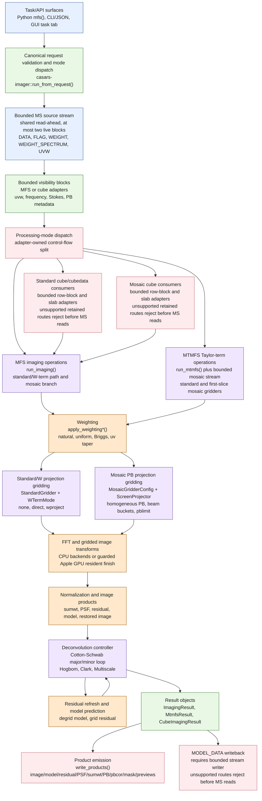
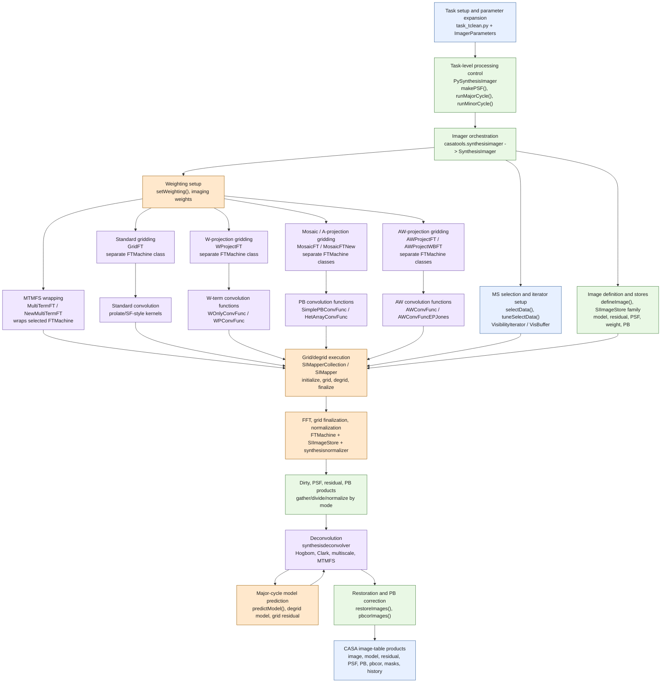
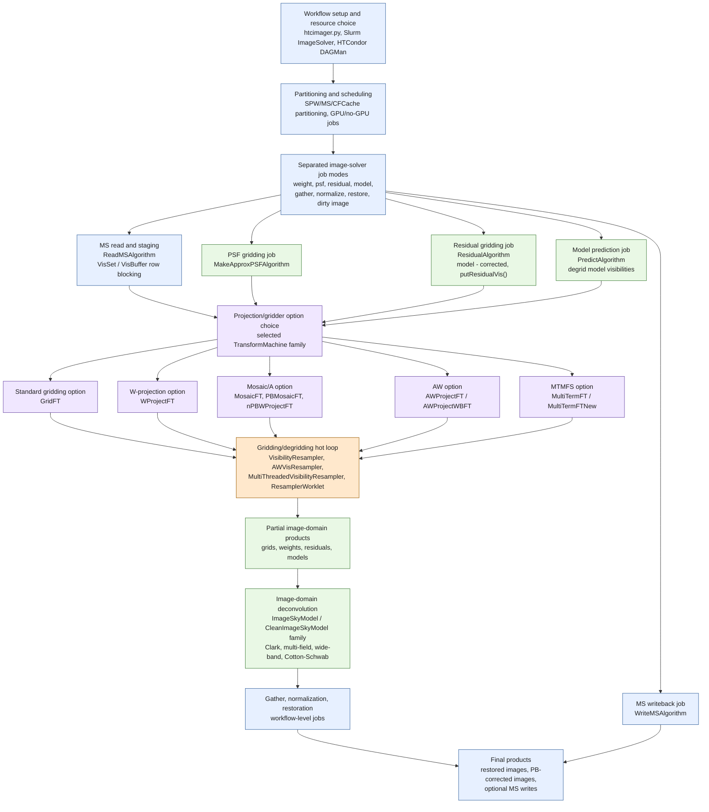

# Imaging Dataflow Comparison

Truth class: exploratory descriptive
Last reality check: 2026-07-09
Verification:
- source inspection only for external CASA C++ and LibRA trees
- `just docs-check`

## Purpose

This note sketches a diagram family for comparing imaging and gridding dataflow
across `casa-rs`, CASA C++, and LibRA. The goal is not only to show where
visibilities, images, PSFs, models, and products move. It is also to show which
functions, classes, crates, scripts, and job wrappers own each stage, so the
diagram can expose refactoring pressure before optimization work starts.

A plain dataflow diagram is insufficient for that question. The useful diagram
is a dataflow plus ownership overlay:

- every node names the data transformation and its current owner
- mode splits are explicit: MFS, cube, MTMFS, mosaic, W-projection, and
  AW-style paths
- resource boundaries are distinct from code organization boundaries
- hot loops and I/O boundaries are tagged for later GPU, thread, and overlap
  work

## Diagram Legend

Colors are defined before the diagrams so that each package overlay can be read
as both a processing pipeline and an ownership map:

- blue: task, I/O, persistence, or external resource boundary
- green: processing operation or core implementation owner
- purple: mode, projection, gridder, or deconvolution option family
- amber: likely hot path for later profiling and optimization
- rose: refactoring pressure, especially control-flow-only splits

## Conceptual Pipeline

This is the common imaging pipeline that the three implementations can be
projected onto.

```mermaid
flowchart LR
    request["Task setup<br/>mode, gridder, deconvolver, products"] --> select["MS read and selection<br/>field, SPW, rows, data column"]
    select --> prep["Flagging and sample preparation<br/>uvw, frequency, Stokes, weights"]
    prep --> density["Weighting<br/>natural, uniform, Briggs, taper"]
    prep --> projection["Projection kernel choice<br/>standard, W, mosaic/A, AW"]
    density --> gridloop["Gridding and degridding<br/>put/get visibility samples"]
    projection --> gridloop
    gridloop --> fft["FFT and inverse FFT<br/>grid/image-domain transform"]
    fft --> normalize["Image normalization<br/>sumwt, flat-noise, PB weight"]
    normalize --> dirty["Dirty, PSF, residual images<br/>beam fit and diagnostics"]
    dirty --> minor["Deconvolution<br/>Hogbom, Clark, multiscale, MTMFS"]
    minor --> refresh["Major-cycle refresh<br/>model prediction, residual gridding"]
    refresh --> minor
    minor --> restore["Restoration and PB correction<br/>restoring beam, pbcor, masks"]
    restore --> products["Product persistence<br/>image tables, previews, MODEL_DATA"]

    classDef hot fill:#ffe8cc,stroke:#9a5b00,color:#1f1f1f;
    classDef io fill:#e7f0ff,stroke:#315f9b,color:#1f1f1f;
    classDef op fill:#e9f8e5,stroke:#3c7a36,color:#1f1f1f;
    classDef mode fill:#f0e7ff,stroke:#6846a3,color:#1f1f1f;
    class request,select,products io;
    class prep,dirty,restore op;
    class projection,minor mode;
    class density,gridloop,fft,normalize,refresh hot;
```

## `casa-rs` Overlay

The current Rust structure has a useful hard boundary: `casa-imaging` is a pure
core that consumes prepared batches and emits products, while `casars-imager`
owns MeasurementSet I/O, mode routing, coordinates, masks, and product writing.
Most near-term collapse pressure is therefore in the adapter/orchestration
layer, not in the pure core boundary.

Refactoring signals visible here:

- `casars-imager` owns source-stream planning, mode dispatch, coordinate
  construction, masks, product writing, and bounded model-column writeback.
  That is a large adapter surface even though the pure core boundary is clean.
- The old retained full-visibility preparation route has been removed from
  production dispatch. Standard MFS, W-projection, mosaic MFS, supported
  standard/mosaic MT-MFS, and supported cube/cubedata/mosaic-cube consumers
  must read through the bounded source stream; modes without a stream consumer
  fail during planning before large visibility-column reads.
- Shared source read-ahead overlaps MS reads with downstream preparation for
  standard MFS, mosaic MFS and MT-MFS replays, cube/cubedata, and mosaic cube.
  The live-block control is currently capped at two and counts the block being
  filled by the producer plus the block owned by the consumer. Its channel has
  capacity `max_live_row_blocks - 2`, so the two-block case is a rendezvous and
  cannot retain an additional queued block. Full-slab spectral routes default
  to one block and disable requested read-ahead when it would reduce modeled
  plane residency or row locality.
- The supported mosaic MT-MFS slice is a replayable, single-MS MFS path with
  `nterms <= 2`, `gridder='mosaic'`, no W term, natural/uniform/Briggs
  weighting, clean or dirty products, and optional PB/PB-corrected output.
  Weight-density replay carries raw UVW separately from mosaic-projected UVW;
  unsupported higher-term, W/AW, pointing, start-model, outlier, and multi-MS
  combinations reject before visibility materialization.
- On Apple platforms, f32 standard and mosaic dirty products can keep FFT,
  correction, normalization, and peak reduction on the GPU. Explicit Metal
  requests use the resident MPSGraph path when supported; `auto` uses a
  profitability guard and CPU fallback for small batches, f64 work, unsupported
  shapes, unavailable devices, or resident command failures.
- Gridder terminology is split across Python task input (`standard`,
  `wproject`, `mosaic`, `awproject`, `awp2`, `awphpg`) and the Rust core
  (`GridderMode::Standard`, `GridderMode::Mosaic`, plus `WTermMode`). That split
  is currently manageable because unsupported modes fail clearly, but it is a
  place where mode semantics can drift.
- Product writing is branch-heavy because MFS, MTMFS, cube, PB, PB-corrected,
  preview, and mask products are all assembled in one output path.

## CASA C++ Overlay

CASA C++ is intentionally layered. The Python `tclean` task and helper classes
own task-level control, the `synthesisimager` tool exposes the C++ imager
object, and `SynthesisImager` delegates actual image and visibility operations
through mapper, image-store, normalizer, deconvolver, and FTMachine families.
The split is large, but much of it corresponds to semantic or runtime
boundaries rather than simple accidental fragmentation.

Refactoring signals visible here:

- CASA C++ is useful as a semantic oracle, not as a direct shape to copy into
  Rust. Its object graph is broad because it supports many historical modes,
  tool boundaries, parallel helpers, image-store variants, and CF-cache flows.
- The `FTMachine` polymorphic family is the key mode boundary for standard,
  W-projection, mosaic/A-projection, AW-projection, and multi-term behavior.
- The helper layer intentionally normalizes some products in Python for MFS and
  MTMFS while cube normalization is handled in C++. That is a mode-specific
  ownership split to understand before mirroring any behavior.
- The `SynthesisImager::runMajorCycle()` loop is the central dataflow bridge:
  iterate `VisBuffer`, optionally degrid/predict model, grid observed or
  residual data, then finalize mapper images.

## LibRA Overlay

LibRA carries much of the CASA synthesis vocabulary, but the distinctive split
is at the workflow and resource boundary. `htcimager` and the ImageSolver
wrappers decompose imaging into job modes such as weight, PSF, residual, model,
gather, normalize, restore, and dirty image. Below that, LibRA keeps transform
machine and image-sky-model families and adds explicit algorithm classes and
threaded resamplers.

Refactoring signals visible here:

- LibRA's extra split is often a resource split, not just a source-file split.
  The workflow layer exists to send gridding/model/residual/restore work to
  local, Slurm, or HTCondor resources.
- The algorithm classes are a useful contrast to `casa-rs`: they name
  distributed image-solver steps directly, whereas `casa-rs` currently names
  mostly in-process request/result functions.
- `MultiThreadedVisibilityResampler` and `ResamplerWorklet` are especially
  relevant for later worker-thread and GPU discussions because they isolate
  grid/degrid/residual hot loops behind a resampler boundary.

## Stage Comparison

| Stage | `casa-rs` owner | CASA C++ owner | LibRA owner | Refactoring / optimization signal |
|---|---|---|---|---|
| Task/API input | `casars-python`, `casars-imager` JSON/CLI, GUI subprocess | `task_tclean.py`, `ImagerParameters` | `htcimager.py`, Slurm/HTCondor ImageSolver wrappers | Keep user/task compatibility at the edge; do not let task syntax leak into the pure core. |
| MS selection and column I/O | `casars-imager` bounded source stream plus shared producer/consumer read-ahead | `SynthesisImager::selectData`, `VisibilityIterator`, helpers | `ReadMSAlgorithm`, per-job MS staging | Read/prepare overlap is implemented with an exact two-live-block ceiling and mode-specific planner guards. |
| Sample shape | `VisibilityBatch`, `VisibilityMetadataBatch`, frontend-private cube channel inputs | `VisBuffer`, `SIMapper`, `FTMachine` input contracts | `VisBuffer`, Applicator records, algorithm payloads | A typed sample/prepared-plane model is a good Rust boundary; avoid spreading it across writers and mode routers. |
| Weighting | `apply_weighting*`, density diagnostics | `setweighting`, normalizer and imaging weights | weight job modes and algorithm payloads | Hot enough for profiling; also a correctness boundary because CASA modes normalize differently. |
| Gridder/projection mode | `StandardGridder`, `WProjector`, `ScreenProjector`, `GridderMode`, `WTermMode` | `FTMachine` subclasses plus convolution-function families | `TransformMachines` plus threaded resamplers | Strong candidate for explicit trait/planning boundary before GPU work. |
| MFS dirty/clean path | `run_imaging()` | `SynthesisImager::makePSF/runMajorCycle` plus deconvolver | residual/model jobs plus sky-model solvers | Dataflow is simple enough to benchmark first. |
| MTMFS path | `run_mtmfs()` for standard gridding; `run_mosaic_mtmfs_from_single_plane_stream()` for the supported `nterms <= 2` mosaic slice | `MultiTermFT`, multi-term image stores, deconvolver/normalizer helpers | wide-band and multi-term transform/sky-model classes | The mosaic path reuses the bounded single-plane stream and shared product writer rather than adding retained visibility state. |
| Cube path | bounded row-block/slab consumers for supported cube, cubedata, and mosaic-cube modes; unsupported retained routes reject before visibility reads | parallel cube helper and cube C++ algorithms | SPW partitioning and image-solver workflow | Shared read-ahead and spectral residency guards now apply here; remaining work is unsupported mode breadth, not a retained full-materialization fallback. |
| Mosaic/A/AW path | `MosaicGridderConfig`, `ScreenProjector`, PB products; AW-family rejected at task edge | `MosaicFT`, `AWProjectFT`, `AWProjectWBFT`, PB/CF families | `MosaicFT`, `AWProjectFT`, `PBMosaicFT`, `nPBWProjectFT` | CASA/LibRA show the likely future class family; Rust should first stabilize a smaller projection-plan abstraction. |
| Minor cycle | `run_cotton_schwab_controller`, Hogbom/Clark/Multiscale variants | `synthesisdeconvolver`, image-store family | `CleanImageSkyModel` family | Keep algorithm choice distinct from task routing and product writing. |
| Residual refresh / prediction | core major-cycle refresh plus bounded stream model prediction/writeback where implemented | `runMajorCycle`, `predictModel`, `VisibilityIterator::Model` writes | `ResidualAlgorithm`, `PredictAlgorithm`, `WriteMSAlgorithm` | This is the bridge where I/O, degrid, grid, and MS writes collide. |
| Product writing | `write_products()`, coordinate builder, previews | image-store plus normalizer/deconvolver helpers and task history | gather/normalize/restore jobs | Product writing is correctness-heavy but should be isolated from mode execution. |
| Parallel/resource model | protocol-v3 local controls, bounded read-ahead, CPU workers, and guarded Apple Metal product finishing | serial and parallel helper variants, MPI release path | local, Slurm, HTCondor, GPU/no-GPU job modes | Diagnostics report live-block, overlap, bandwidth, queue/worker, memory, and backend/fallback facts; distributed execution is still outside the current Rust runtime. |

## How To Read Split Pressure

This diagram style can show whether functionality is spread across too many
functions or modules, but only if the reader distinguishes three split types.

Keep a split when it is a real boundary:

- different data shape, such as raw MS rows versus prepared scalar visibility
  batches
- different resource location, such as local process versus Slurm/HTCondor job
- different external contract, such as Python task syntax versus Rust core API
- different algorithm family, such as standard gridder versus AW-projection
- different persistence contract, such as in-memory image arrays versus CASA
  image tables or `MODEL_DATA`

Question a split when it only changes control flow:

- several functions pass the same request and data shape through mode-specific
  branches
- product writing branches know too much about how each mode was executed
- unsupported-mode checks are duplicated at task, adapter, and core layers
- cube and MFS paths run equivalent per-plane loops in different modules
- diagnostics and timings are assembled in many places after the same stage

For `casa-rs`, the immediate hypothesis is not "collapse the core." The cleaner
hypothesis is:

1. Keep `casa-imaging` as the prepared-batch pure core.
2. Extract an explicit prepared run plan in `casars-imager` that owns mode
   dispatch, plane looping, and clean-mask seeding.
3. Extract product emission behind a product manifest or writer abstraction so
   MFS, MTMFS, cube, PB, pbcor, mask, preview, and model-column outputs do not
   all expand one function.
4. Make gridder/projection planning a named boundary before adding fast W/A/AW
   kernels, GPU implementations, or multi-worker execution.

## Optimization Map

Once the shape is stable, this same diagram can be annotated with timings and
resource ownership.

Current `casa-rs` measurement points include:

- MS column loads, source bytes, effective bandwidth, producer/consumer
  blocking, and read/prepare overlap in the bounded source stream readers
- weighting density construction
- standard gridder and W/screen projector sample loops
- CPU or Apple GPU-resident FFT, correction, normalization, transfer, device,
  and fallback timings
- residual refresh/degrid during major cycles
- CASA image-table product writes and preview generation
- optional `MODEL_DATA` writes

Current and next optimization experiments:

- streaming or chunked prepared batches to reduce peak memory
- tune shared bounded read-ahead only where overlap exceeds its residency and
  locality cost
- Rayon or scoped-worker parallelism behind gridder/projector traits
- extend the guarded Apple GPU resident-product boundary only after medium and
  large product-equivalence and no-slowdown evidence
- separate product emission workers after core results are available
- reuse of LibRA-style resampler/worklet ideas for grid/degrid hot loops

## Source Context For Circulation

The diagrams were checked against local source snapshots rather than inferred
only from package names. For circulation, the relevant repo anchors are:

- `casa-rs`: <https://github.com/bglenden/casa-rs.git> at
  `3ed73fc6dac066c8f3f63c6dbbf79e6aee390151`
- CASA C++/CASA6: <https://open-bitbucket.nrao.edu/scm/casa/casa6.git> at
  `61020062cee290f5466cffed5ec5032e0c7a3434`
- LibRA fork: <https://github.com/bglenden/libRA> at
  `0ab99e261878334d6588eafa360cef3b673e897f`
- LibRA upstream: <https://github.com/ARDG-NRAO/LibRA.git>

## Source Paths Inspected

- `crates/casa-imaging/src/lib.rs`
- `crates/casa-imaging/src/cube.rs`
- `crates/casa-imaging/src/types.rs`
- `crates/casars-imager/src/lib.rs`
- `crates/casars-python/python/casars/tasks/imager.py`
- `/Users/brianglendenning/SoftwareProjects/casa/casatasks/src/private/task_tclean.py`
- `/Users/brianglendenning/SoftwareProjects/casa/casatasks/src/private/imagerhelpers/`
- `/Users/brianglendenning/SoftwareProjects/casa/casatools/src/code/synthesis/ImagerObjects/`
- `/Users/brianglendenning/SoftwareProjects/casa/casatools/src/code/synthesis/TransformMachines/`
- `/Users/brianglendenning/SoftwareProjects/libRA/frameworks/htcimager/`
- `/Users/brianglendenning/SoftwareProjects/libRA/doc/AlgoArch/README.md`
- `/Users/brianglendenning/SoftwareProjects/libRA/src/synthesis/MeasurementComponents/`
- `/Users/brianglendenning/SoftwareProjects/libRA/src/synthesis/TransformMachines/`
