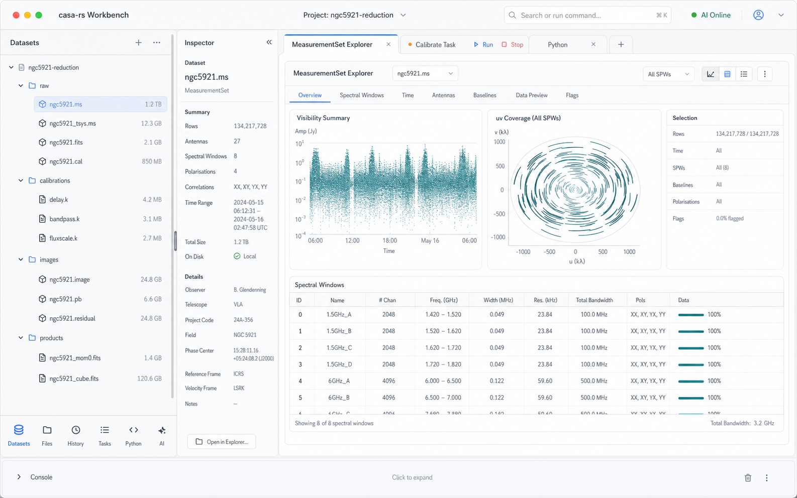
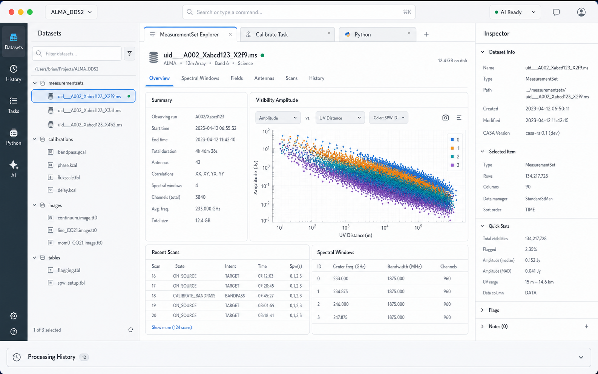
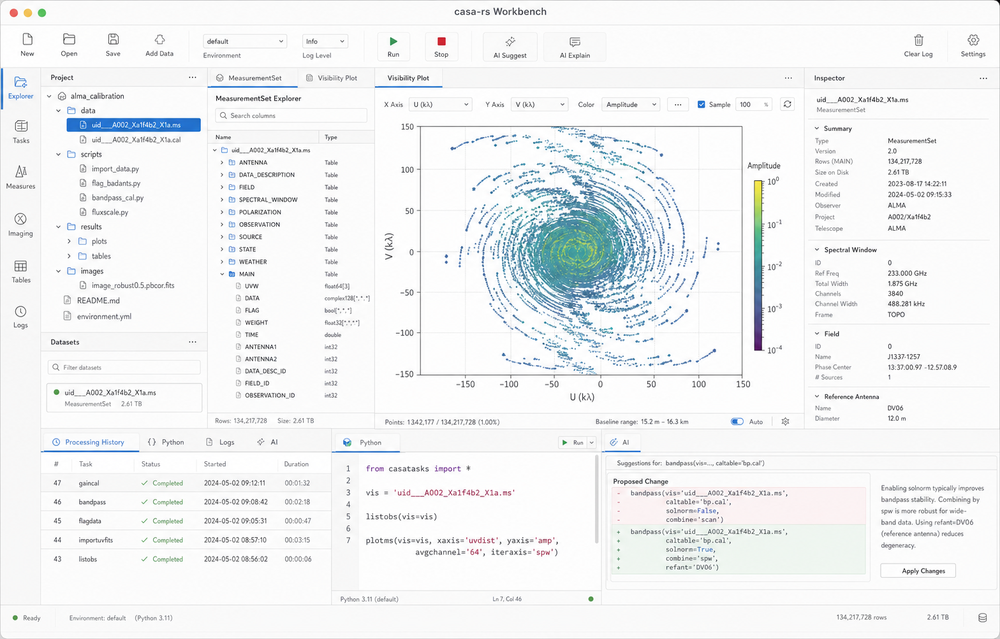

# Mac-Native GUI Mockups

Truth class: proposed visual agreement
Last reality check: 2026-05-03
Verification: image-generation draft

This document captures visual mockups for the mac-native `casa-rs` workbench.
It is a companion to [`mac-native-gui-spec.md`](mac-native-gui-spec.md), not a
replacement for the product and architecture spec.

The goal is to agree on approximate organization before implementation hardens
the UI. These mockups are intentionally allowed to lead backend work: visual
fixtures may show desired panels, states, and interactions before the canonical
provider protocols exist.

## Visual Principles

- Native macOS workbench, not a web app in a wrapper.
- `casa-rs` product identity; CASA/casacore language appears only for
  interoperability or evidence.
- Screen real estate is precious. Avoid showing every major panel at once.
- The left dock contains one active navigation panel at a time, such as
  datasets, files/project view, or processing history.
- Small mode icons at the bottom of the left dock switch what replaces the
  active navigation panel.
- The tab `+` belongs to the central workspace tab strip. It opens a new central
  work tab; it does not switch left-dock modes.
- Full explorers and task panels live in central tabs.
- AI chat is a first-class central tab. Inline AI suggestions and task diffs
  are supporting surfaces, not a replacement for chat.
- Lightweight inspector sits immediately to the right of the active left-dock
  navigation panel and is completely collapsible.
- Bottom panels such as logs or Python should be collapsed or short by default.
- Inspector stays fast, selection-scoped, read-mostly, and cache-backed.
- Explorers can be large, stateful, and feature-rich.
- AI suggestions are visible as proposals or diffs, not silent mutation.
- Fixture/demo states must be visibly labeled once implemented.
- Opening or creating projects is normal macOS menu behavior, not large
  always-visible chrome. Users normally open a project directory.
- `Run` / `Stop` controls belong to the header of an individual task tab, not
  the global application toolbar.

## Overall Workbench

### V3 Current Direction

#### Decisions Captured

- The left side is a dock, not a separate global activity rail plus a sidebar.
- The dock shows one navigation source at a time: `Datasets`, file/project
  view, or Processing History.
- Bottom icons in the dock switch the active navigation source.
- The inspector is adjacent to the active navigation source, not on the far
  right of the whole window.
- The inspector is fully collapsible.
- The central workspace uses tabs aggressively for explorers, task panels,
  Python, and other work surfaces.
- The central tab `+` opens a new work tab; it is distinct from left-dock mode
  switching.
- Task `Run` / `Stop` controls remain task-tab-local.

#### Open Visual Questions

- Should the inspector collapse to a thin vertical handle, a split-view button,
  or disappear entirely until reopened from the dataset selection?
- Should bottom dock icons be icon-only with tooltips, or include tiny labels?
- Should Processing History usually replace `Datasets` in the left dock, or
  open as a central tab when the timeline needs more width?
- Should the file/project view and dataset view be separate left-dock modes, or
  should the dataset view be a semantic grouping inside the file/project mode?

## Decision Log

### 2026-05-04: AI Chat Is A First-Class Work Tab

Decision:

- The app has an AI chat terminal/tab, not only inline suggestions.
- AI suggestions can still appear as proposed diffs in task panels.
- The AI chat tab is a central workspace tab and can reference selected
  datasets, task tabs, Python output, and processing history.

Rationale:

- Users need a conversational workspace for exploration, planning, and
  follow-up questions, not only point actions.

Status: accepted for mockups

Supersedes: inline-suggestions-only interpretation

### 2026-05-04: GUI Work Uses GUI-Wave Names

Decision:

- GUI planning and implementation issues should use names such as
  `GUI-Wave-1`, `GUI-Wave-2`, and so on.
- Do not use plain `Wave 1`, `Wave 2`, etc. for GUI work.

Rationale:

- The repo already has tutorial-parity work using numbered waves, including
  active Wave 6 work. GUI issue names must stay distinct on the project board.

Status: accepted for planning

### 2026-05-04: Testability Is A First-Class UI Requirement

Decision:

- The clickable GUI prototype must include headless model tests and runtime
  state introspection from the beginning.
- The UI should be built around explicit state and actions rather than
  screenshot-only manual verification.

Rationale:

- Retrofitting debug and test hooks into a GUI after it grows is expensive and
  usually leaves the app hard to maintain.

Status: accepted for planning

### V2 Superseded Direction

V2 moved in the right direction by reducing always-visible surfaces and using
central tabs, but its far-left icon rail and central tab `+` made the mode
model confusing.

#### Decisions Captured

- Use a compact activity bar to choose what appears in the left panel.
- Show exactly one left-side content panel at a time; the example uses
  `Datasets`.
- Use central tabs aggressively for explorers, task panels, and Python.
- Treat task execution as tab-local: `Run` and `Stop` appear in a task tab
  header, not in the global toolbar.
- Keep the global toolbar minimal: project identity, command/search, AI status,
  and other app-level controls.
- Keep Processing History as a switchable panel or central tab rather than a
  permanently visible bottom panel.
- Keep the right inspector lightweight and optional.

#### Decisions Superseded

- Do not use a separate far-left activity rail if bottom dock icons can switch
  left navigation modes more clearly.
- Do not place the inspector on the far right as a general app inspector by
  default; keep it adjacent to the dataset/navigation context.

### V1 Overloaded Direction

V1 is retained as a rejected/overloaded iteration. It showed too many major
surfaces at once and overused persistent panels.

#### Decisions Rejected

- Do not show project, datasets, processing history, Python, and AI all as
  active always-visible panels.
- Do not put `Run` / `Stop` in the global toolbar.
- Do not expose `New` / `Open` as large persistent window chrome.
- Do not make the bottom panel large by default.

## Panel Mockup Queue

Generate and iterate these panel-specific mockups after the overall layout is
accepted:

1. Project explorer and dataset finder.
2. Lightweight inspector.
3. MeasurementSet explorer.
4. Task panel with AI parameter diff.
5. Processing History / provenance timeline.
6. Dual-ported Python and matplotlib panel.
7. AI chat terminal and Oracle assistant panel.
8. Image explorer with cube slice or movie controls.
