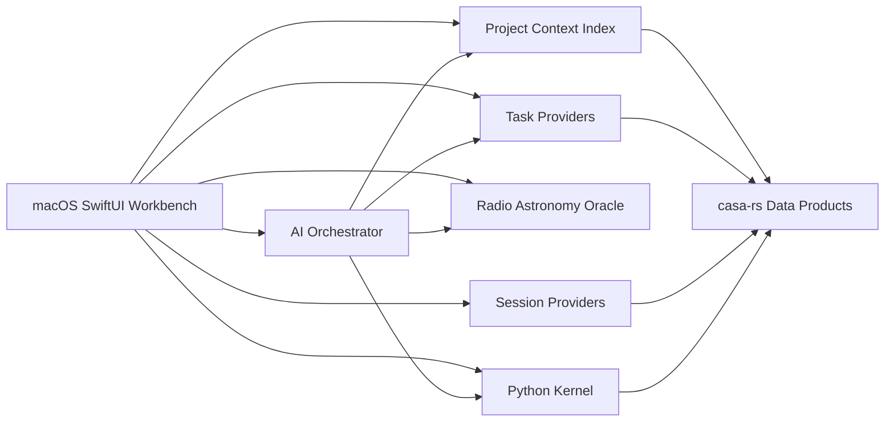

# Mac-Native GUI Product Spec

Truth class: proposed product spec
Last reality check: 2026-05-03
Verification: not implemented

## Product Thesis

The mac-native `casa-rs` GUI should be an AI-enhanced desktop workbench for
radio astronomy data processing.

The useful analogy is "VS Code for radio astronomy data": a project-oriented
application where datasets, derived products, task runs, plots, scripts,
notebooks, and domain help are all visible in one coherent workspace. The app
is not a simple GUI wrapper around command-line flags. It should understand the
open project, the datasets in that project, the currently selected data product,
the available task contracts, and the user's analysis conversation.

The first durable differentiator over `casars` is native AI integration:

- AI can inspect project context and dataset summaries.
- AI can fill or revise task parameters with user approval.
- AI can drive Python exploration and explain the resulting plots.
- AI can answer radio astronomy and casa-rs questions through a local Radio
  Astronomy Oracle panel.
- AI actions are visible, reversible where practical, and recorded in run or
  conversation history.

## Target User

The primary user is a radio astronomer who wants a convenient local interface
for understanding and processing casa-rs data products.

The app should support users who understand radio astronomy reduction concepts
but do not want to spend all day switching between terminals, Python shells,
image viewers, plotting scripts, documentation, and scattered output
directories. It should also help less frequent users recover the right task
parameters from the actual dataset in front of them.

## Relationship To CASA

This is a user interface for `casa-rs`.

CASA is an inspiration and a compatibility reference, not the product identity
or runtime implementation. The GUI should not present itself as a CASA frontend
and should not depend on CASA for normal execution. `casa-rs` shares no CASA
runtime code; CASA/casacore may still appear in interoperability language,
testing, comparison evidence, or format compatibility notes.

Product copy rules:

- product identity is `casa-rs`
- use "casacore-compatible" or "CASA-compatible format" only for data-format
  interoperability
- keep CASA comparisons in diagnostics, testing, and evidence views
- avoid UI labels that imply CASA runtime execution or CASA task compatibility
  unless that capability is actually implemented

## Product Goals

- Make project data discoverable.
- Make each dataset type inspectable through a type-aware viewer.
- Make common processing tasks easier to configure correctly.
- Keep arbitrary Python and matplotlib exploration close to the data.
- Preserve reproducibility through explicit task requests, run manifests,
  products, logs, and AI action history.
- Use and extend the provider-contract model so CLI, TUI, Python, native GUI,
  AI, and future MCP surfaces do not drift.
- Prefer native macOS interaction patterns: sidebars, inspectors, toolbars,
  command menus, keyboard shortcuts, multiple windows, drag/drop, and standard
  file panels.

## Non-Goals For The First Product Slice

- Building a branded frontend for another runtime or making another runtime the
  primary execution backend.
- Building an IDE for Rust development.
- Exposing every historical task surface before product need.
- Forking GUI-only task semantics. Expanding canonical provider protocols for a
  first-rate GUI is explicitly in scope.
- Freezing pixel layouts or app-specific controls into provider schemas.
- Creating a new top-level app family without explicit implementation approval.

## Workbench Model

The app is organized around a project workspace. A project is a local directory
with casa-rs-readable datasets, derived products, and run artifacts. The user
can open a folder, open a specific dataset, or create a lightweight project
wrapper around existing files.

The default window should use a native macOS workbench layout:

- left activity/sidebar for project explorer and major work areas
- central editor/detail area for data viewers, task panels, Python notebooks,
  plots, and run products
- right inspector for selected dataset metadata, task context, AI suggestions,
  and provenance
- bottom panel for Python, logs, task output, diagnostics, and problems
- command palette for task, data, and AI actions

The app should support multiple tabs or editor panes because users naturally
compare an MS summary, a visibility plot, a task request, an image plane, and a
Python plot while reducing data.

## Core Panels

### Project Explorer

The project explorer discovers radio astronomy data products in the open folder.

It should group files by semantic type rather than showing only raw filesystem
layout:

- MeasurementSets
- persistent images
- calibration tables
- FITS files
- task run directories
- generated plots
- manifests and logs
- scripts and notebooks

Each item should expose quick actions:

- open type-aware explorer
- reveal on disk
- inspect metadata
- use as input to a task
- ask AI about this dataset
- open in Python context

The explorer should keep enough filesystem truth visible that users can still
reason about paths and interoperability.

### Inspector Versus Explorer

The app should distinguish lightweight inspectors from full explorers.

An inspector is a compact side-panel view for basic facts about the selected
object:

- path, type, size, and freshness
- axes, units, shapes, columns, or product role
- quick provenance and warnings
- compatible actions and task inputs
- links to richer explorers

An explorer is a full workbench surface for deep interaction:

- MeasurementSet plots and table navigation
- image plane viewing, cube slicing, movies, masks, and region statistics
- calibration table inspection and diagnostic plots
- linked selections across plots, tables, and images
- larger controls that do not fit in an inspector

Inspectors should stay fast and always useful. They are selection-scoped,
read-mostly, cache-backed, and latency-bounded. Inspectors may show stale/cache
status, but they should not trigger expensive materialization without explicit
user action.

Explorers can be large, stateful, and feature-rich. AI suggestions, task
preparation, and long-running provider calls belong in explorers, task panels,
or AI panels rather than turning the inspector into a slow mini-workbench.

### Dataset Explorers

Clicking a dataset opens the best available type-aware explorer.

Initial explorer targets:

- MeasurementSet explorer using the existing `msexplore` and table browser
  surfaces.
- Image explorer using the existing `imexplore` session surface.
- Table/calibration-table explorer using the existing `tablebrowser` session
  surface.

The explorer should show a summary first, then let the user move into richer
views:

- metadata and shape
- fields, spectral windows, scans, antennas, correlations, and data columns
- table structure and typed cell inspection
- image axes, coordinate system, masks, statistics, slices, and moments
- plots relevant to the selected product
- provenance and generated products

For large datasets, the UI must distinguish slow open/materialization work from
rendering. The user should see progress and cancellability rather than a blank
or apparently frozen panel.

The desired MeasurementSet explorer is stateful enough that it probably should
not be forced through a one-shot task surface. Before real provider integration,
choose one of these approaches:

- keep `msexplore` as a one-shot summary/plot generator and add a separate
  MeasurementSet session or object surface for the workbench
- expand `msexplore` with a versioned `--session` protocol

The UI-first prototype may use a fixture-backed MeasurementSet explorer before
that decision is implemented, but the fixture protocol must be marked
experimental.

### Processing History

The workbench should provide a high-level history of data processing activity:
what happened, when it happened, what data it affected, and why it was done.

The history should show:

- imported or discovered datasets
- task runs and AI-assisted actions
- Python explorations that produced saved snippets, plots, or products
- generated products and changed persistent data
- parameter diffs, user approvals, and run reasons
- warnings, failures, retries, and downstream stale products

The underlying persistent data structures are not intrinsically versioned, so
the history must be honest about what can and cannot be reconstructed.

The first version is an append-only provenance timeline, not a restoration
system:

- event records for task runs, Python actions, and user annotations
- before/after metadata snapshots where cheap enough
- file fingerprints, mtimes, sizes, and product roles
- links from timeline events to affected products and generated diagnostics
- replayable canonical requests when full data restoration is not available

Reserve "time machine" for a future snapshot/restore feature with explicit
pre-change snapshots and restore semantics. Fixture/demo history must be
clearly labeled and must never be mixed into real project history as if it were
observed fact.

The first version should let a user answer: "What did I do to this project,
why, and what changed?"

### Task Panels

Task panels configure and execute casa-rs processing tasks.

The first real task family is a pre-implementation decision, not a detail to
defer until after the task-panel framework exists. Choose it with a small
decision matrix:

- provider maturity
- dataset-aware parameter richness
- write-safety profile
- demo value for AI assistance
- output product clarity
- validation needs
- provenance and run-manifest needs

Likely candidates are `calibrate` and `casars-imager`. The UI-first prototype
may use a mocked task contract while this decision is still open.

Task panels are projected from provider schema bundles. The GUI may add native
layout and interaction, but it must not invent a separate semantic schema.
When current provider bundles are not expressive enough for a first-rate native
UI, the right fix is to expand the canonical provider protocol rather than
work around it locally in the app.

Task parameters should be context-sensitive:

- dataset picker constrained to compatible inputs
- field/spw/scan/antenna/correlation choices populated from the selected
  MeasurementSet
- output paths defaulted relative to the project
- advanced parameters hidden until requested
- validation errors tied to both schema rules and dataset-specific facts
- previews or estimated products shown when available

Execution should produce a durable run record:

- canonical JSON request
- resolved dataset context
- command or provider version
- stdout/stderr
- generated products
- diagnostics
- AI suggestions that affected the request
- user approvals

### Python And Matplotlib Panel

The app should include an interactive Python panel for arbitrary exploration.

The Python environment should understand the current project and selected
datasets:

- expose selected paths as Python variables or snippets
- import `casars` Python package helpers
- provide convenient loaders for tables, images, and MeasurementSets
- capture matplotlib output into native plot tabs
- allow AI to propose or run Python only with clear user-visible intent

Python is both an expert escape hatch and an AI execution substrate. The app
should make it easy to move from a plot or table selection into a short Python
exploration, then preserve useful snippets in the project history.

The Python terminal should be dual-ported. Both the user and AI can write into
the same terminal surface, but only one actor owns input at a time.

Required behavior:

- visible ownership state: user-controlled, AI-controlled, running, or paused
- AI-generated input appears in the terminal before execution
- while AI controls the terminal, user typing is locked out except for stop or
  reclaim-control actions
- the user can interrupt a running command or revoke AI control
- executed code, output, plots, and ownership changes are recorded in project
  history
- AI must not execute hidden Python outside this visible terminal or an
  equivalently audited execution surface

Minimum Python execution policy before real execution:

- read roots are explicit and visible to the user
- default writes go under a project-managed output directory
- in-place persistent data mutation requires separate approval
- subprocess and network access require explicit approval
- environment variables and secrets are hidden from AI context packs by default
- package imports are recorded and unresolved imports produce visible guidance
- kernel lifetime, reset, interrupt, and kill behavior are explicit
- long-running or background work is visible in the workbench
- audit records distinguish read-only code, file-writing code, subprocess code,
  networked code, and in-place mutation

### Radio Astronomy Oracle Panel

The Oracle panel answers radio astronomy and casa-rs questions in the context
of the current project.

It should be able to use:

- selected dataset metadata
- active task parameters
- run manifests and logs
- generated plots and image statistics
- local Radio Astronomy Oracle corpus retrieval
- casa-rs provider schema descriptions
- relevant user conversation

Oracle answers should cite their evidence when they come from documentation or
local corpus sources. When an answer affects processing parameters, the app
should turn that into an explicit suggestion rather than silently mutating a
task panel.

### AI Assistant Surface

AI should be integrated across panels, but the workbench also needs a
first-class AI chat terminal/tab. Inline suggestions are one AI output mode,
not the whole AI surface.

The AI chat tab is a central workspace tab. It can reference selected datasets,
open task tabs, Python output, processing history, and active explorer state.
It should support ordinary conversation, planning, command preparation, and
follow-up questions without requiring the user to leave the workbench.

Useful first capabilities:

- explain the selected dataset or plot
- answer questions in a persistent AI chat tab
- recommend task parameter defaults from dataset context
- fill a task panel from a conversation
- compare two candidate task requests
- generate Python exploration snippets
- run Python snippets after user approval
- summarize task output and errors
- suggest next diagnostic plots
- open the relevant Oracle answer when the user asks conceptual questions

The assistant should operate on an explicit context pack:

- selected project
- selected dataset or product
- active explorer state
- active task schema and current request
- recent run history
- Python snippets and plots marked as relevant
- user conversation

The AI should report what context it used. When context is missing, it should
ask for the missing dataset or panel selection instead of hallucinating a
reduction workflow.

AI chat output that changes workbench state should become explicit proposals:

- task parameter diffs
- Python snippets
- task requests
- dataset or tab navigation actions
- processing-history annotations

Those proposals must still go through the approval and audit model before they
execute or mutate state.

## Safety And Trust Model

AI can suggest, draft, and prepare actions. User approval is required before:

- executing a task that writes products
- editing or deleting data products
- running arbitrary Python that writes files or invokes subprocesses
- changing task parameters after a user has reviewed them
- applying flags or calibration changes to an existing MeasurementSet

The default first slice should be read-mostly except for task runs that write
new products under a project-managed output directory. In-place mutation should
be a later, explicitly designed capability.

Every AI-assisted state change should leave an audit trail:

- prompt or user instruction
- context pack summary
- proposed diff or command
- user approval
- execution result

First-slice AI privacy defaults:

- AI context packs are explicit, previewable, and auditable.
- Cloud model use is opt-in.
- Raw data, logs, local paths, and Python snippets are redacted or individually
  approved before transmission to a cloud model.
- The project history records the model/provider, context-pack summary, and
  whether raw or redacted context was used.
- Local-only AI can be supported later, but the UI should not imply local-only
  execution unless that is actually true.

## Architecture Direction

The GUI belongs at the apps/runtimes layer. It depends on boundary contracts,
domain libraries, and existing provider binaries or libraries. It must not
become a second source of truth for task semantics.

This does not mean the GUI is constrained to the current provider protocols.
The native workbench and AI surfaces are legitimate drivers for protocol
expansion. If the UI needs richer progress, dataset-specific choices,
preview/dry-run output, structured provenance, cancellable long-running
operations, or AI-readable context, those should become canonical protocol
capabilities that other consumers can also use.

Candidate shape:

Provider integration should follow existing contracts:

- task surfaces use `--protocol-info`, `--json-schema`, and `--json-run`
- session surfaces use `--protocol-info`, `--json-schema`, and a stateful
  `--session` transport
- object surfaces should use handle-based access where direct in-process access
  is the right model

The native app should read provider schemas and project them into SwiftUI
controls with coarse presentation hints. Dataset-specific choices should come
from casa-rs summaries and session/object queries, not hard-coded GUI lists.

For v0, the native app should supervise provider subprocesses over JSON and
JSON Lines protocols. Direct Rust in-process object access should wait until
FFI, threading, lifetime, and cancellation rules are designed. Long-running
operations need explicit cancellation semantics:

- provider-level cancel request when the protocol supports it
- process signal fallback when cancellation is not yet protocol-native
- timeout behavior
- partial-result and partial-diagnostic handling

## Technology Stack Decisions

These choices should be made before the first clickable prototype:

- Native macOS app shell: SwiftUI.
- AppKit only for escape hatches SwiftUI does not model cleanly.
- Package-first testable core: keep workbench models, actions, fixture
  providers, and debug state in SwiftPM library targets that can run under
  `swift test`.
- The GUI prototype may use a SwiftPM runnable target or an Xcode app target,
  but the reusable state and provider logic must remain package-testable.
- Use `WindowGroup` for the primary workbench window.
- Use explicit desktop affordances: menus, commands, keyboard shortcuts,
  split views, inspectors, tabs, settings, and native file panels.
- Start with fixture providers and static plot/image assets.
- Do not start with Electron, Tauri, a webview UI, or direct Rust in-process
  bindings.
- Defer charting, image rendering, Python kernel, and real AI provider library
  choices until panel behavior proves what is needed.

The key architectural requirement is not just "native SwiftUI." It is
"native SwiftUI over a headlessly testable workbench core."

GUI-Wave-0 implements this in `apps/casars-mac` as a SwiftPM package with a
`CasarsMacCore` library and `casars-mac` SwiftUI executable. The prototype
remains fixture-only until real provider-contract work is explicitly approved.

## Testability And Debuggability

The GUI must be testable without relying on manual screenshot exchange.

Required from the beginning:

- Put durable state in a pure Swift workbench model/store, not scattered
  view-local `@State`.
- Drive behavior through explicit actions such as `openProject`,
  `selectDockMode`, `selectDataset`, `openTab`, `collapseInspector`,
  `applyAISuggestion`, `appendAIChatMessage`, and `runTask`.
- Keep fixture providers deterministic and injectable.
- Unit-test model, provider, and action behavior headlessly with SwiftPM.
- Add stable accessibility identifiers for every important control and state:
  dock mode buttons, central tabs, tab `+`, inspector collapse, task `Run` /
  `Stop`, AI chat input, Python ownership state, selected dataset, and history
  rows.
- Add UI tests for the main flows once a runnable app shell exists.
- Use screenshots for visual polish review, not as the only way to understand
  behavior.

The prototype should also include a debug-only introspection surface. It may be
a localhost-only JSON endpoint, Unix-domain socket, or test-only in-process API.
The exact transport can be chosen during implementation, but the exposed state
should include:

- active project
- active left-dock mode
- selected dataset
- inspector collapsed/expanded state
- open central tabs
- active central tab
- task run states
- AI chat messages and proposal states
- Python terminal ownership state
- processing-history events
- last errors and logs

This debug surface is for local automation and troubleshooting. It must not
become a public provider contract unless deliberately promoted later.

## Protocol Expansion Requirements

Protocol expansion is a product feature, not just plumbing. A first-rate native
GUI likely needs protocol capabilities that are broader than today's CLI/TUI
surfaces.

Candidate expansions:

- project and dataset discovery APIs that classify casa-rs-readable products
- lightweight dataset summaries suitable for sidebars and AI context packs
- context-dependent parameter option queries, such as legal fields, spectral
  windows, scans, antennas, correlations, image axes, and output-product roles
- structured validation that can explain schema errors and dataset-specific
  incompatibilities before execution
- dry-run or preview modes that return expected products, output paths,
  warnings, and recommended diagnostic plots
- streaming progress events with phase names, percent or unit progress where
  meaningful, cancellability, and partial diagnostics
- durable run-manifest schema shared by task panels, AI history, and project
  explorer provenance
- plot and image-view protocols that can return typed data, bitmap previews,
  linked selections, and reusable Python snippets
- AI action protocols for proposed parameter diffs, proposed Python snippets,
  context-pack summaries, approval records, and execution results
- typed error envelopes with stable codes, user-facing recovery suggestions,
  and debug details

Rules for expansion:

- The canonical protocol changes first for real provider integration; the
  SwiftUI surface projects from it.
- New capabilities are versioned and discoverable through protocol metadata.
- GUI annotations remain hints; semantic meaning lives in the provider
  contract.
- Protocol changes should be useful to at least one non-GUI consumer where
  practical, such as Python, MCP, tests, or `casars`.
- Long-running operations must have an explicit progress, cancellation, and
  result model rather than relying on stdout scraping.
- AI-facing context must be explicit and auditable, not an implicit capture of
  hidden UI state.

Prototype exception:

- UI fixture schemas may precede canonical provider protocols only when they
  are marked experimental.
- Experimental schemas must map each field or event to a proposed provider
  capability.
- Experimental schemas must be blocked from real provider integration until the
  canonical contract, versioning, and drift tests exist.

## macOS Native Shape

The app should feel like a serious desktop tool, not a web app in a window.

Expected macOS conventions:

- `NavigationSplitView`-style source list for project/workbench navigation
- toolbar actions for open, run, stop, plot, ask, and compare
- command palette for datasets, tasks, and AI actions
- inspectors for metadata, schema help, and provenance
- standard settings window for model, Python, data-root, and execution settings
- multiple windows or tabs where useful
- drag and drop for opening datasets
- keyboard shortcuts for common expert actions
- native file panels and recent projects

The first implementation should prefer SwiftUI. Use AppKit only for behaviors
SwiftUI does not model cleanly, such as specialized panels, responder-chain
integration, or lower-level window control.

## UI-First Implementation Strategy

The first implementation should prioritize UI shape and interaction quality,
even when provider functionality is stubbed or fake.

The reason is practical: once a lot of backend code and provider assumptions
are baked into the UI, changing the user experience becomes expensive. Early
work should validate the workbench model with believable data and fake
providers before treating current protocol limitations as product constraints.

Allowed early scaffolding:

- static project fixtures
- fake MeasurementSet, image, calibration-table, and run-output inventories
- mocked task schemas and context-dependent parameter options
- fake task execution timelines, logs, progress, products, and failures
- stubbed AI suggestions and parameter diffs
- stubbed Python terminal ownership states and captured plot examples
- generated or fixture-backed image cube/movie views

The fake layer should be shaped like the desired protocol contracts, but it
must be labeled as fixture or demo data in the UI. When the UI proves that a
protocol capability is needed, the canonical provider protocol should be
expanded to match the product need before real provider integration.

Long-term architecture decisions can change for the health of the project.
There are no real users yet to preserve compatibility for. Existing ADRs and
layering rules are important starting points, but if the native workbench
exposes a better long-term architecture, the right path is to propose and
supersede decisions deliberately rather than contort the UI around old
assumptions.

## Context Index

The app needs a project context index so panels and AI can share facts without
rescanning everything independently.

The index should track:

- discovered dataset paths and semantic types
- lightweight metadata summaries
- known relationships between inputs, runs, and products
- provider compatibility with each dataset
- slow-to-compute summaries and their freshness
- user labels or notes

The index is not a replacement for on-disk data. It is a cache and navigation
aid. Scientific truth remains in casa-rs-readable persistent data and durable
run artifacts.

## First Product Slice

A credible first slice should demonstrate the new product value without trying
to cover all radio astronomy workflows.

Suggested v0 demo spine:

1. Open a project folder and show a project explorer with real or fixture
   MeasurementSet discovery.
2. Open one MeasurementSet explorer with summary, field/spw/scan views, and a
   small set of visibility plots.
3. Open an AI chat tab that can discuss the selected dataset and prepare a
   proposed task change.
4. Open one task panel backed by either the selected first real task contract or
   a clearly marked fixture task contract.
5. Show one AI parameter suggestion as a visible proposed diff against the task
   request.
6. Require user approval before applying the AI suggestion or running the task.
7. Run or simulate the task into a project-managed output directory and show a
   durable run record.
8. Show a provenance timeline for that run with affected paths, run reason,
   request summary, approvals, logs, products, and warnings.
9. Verify the flow through headless model tests plus a debug-state query of the
   running app.

Fixture-only or v0.x follow-ons:

- image explorer with cube slicing or movie playback
- full Python terminal and matplotlib capture
- Oracle panel backed by local corpus retrieval
- broad project discovery across all supported product types
- rich linked selections across plots, tables, and images
- snapshot/restore time-machine behavior

This slice should be strong enough to answer: "What can AI do here that the
current `casars` TUI cannot?"

## Open Product Questions

- Which first task best demonstrates context-aware AI: calibration or imaging?
- Should the Python panel be a simple REPL first, a notebook-like surface, or a
  script editor with captured plots?
- Should AI execution be local-only initially, cloud-model backed, or support
  both through a model settings abstraction?
- Should project metadata be stored in a `.casa-rs/` directory, sidecar JSON,
  or only memory/cache for the first slice?
- How much interoperability language should be visible in the product UI,
  versus kept in diagnostics and developer evidence?
- Should optional comparison backends exist only for testing/evidence, or should
  any comparison workflow be user-visible?
- What is the minimum acceptable image viewer: static planes, cube slicing,
  region statistics, or linked plot/image selection?
- What is the minimum acceptable MeasurementSet visibility-plot interaction for
  the first explorer?
- What is the first durable MeasurementSet explorer protocol:
  `msexplore --session`, a separate session provider, or an object surface?
- What is the first durable processing-history model: event history only,
  before/after metadata snapshots, or opt-in file snapshots for write actions?

## Implementation Gates

Before implementation, this spec should become a shaped issue or wave with:

- GUI-specific issue title and board naming, such as `GUI-Wave-1`, to avoid
  collision with tutorial-parity wave numbers
- explicit first task choice
- explicit write-safety boundary
- selected provider surfaces
- MeasurementSet explorer surface decision
- first-task decision matrix result
- AI provider and privacy assumptions
- Python execution sandbox expectations
- dual-ported Python terminal ownership model
- expected project metadata format
- expected processing-history persistence model
- prototype schema governance and fixture-labeling rules
- v0 transport/runtime model and cancellation behavior
- SwiftUI / SwiftPM testability plan
- debug introspection bridge plan
- accessibility identifier plan
- browser/manual verification plan for the native GUI
- `just quick` and `just verify` expectations, or recorded exclusions

Any implementation that creates a new top-level crate, package, app family,
provider contract, runtime model, or substantial dependency requires explicit
approval under the repo operating contract.
